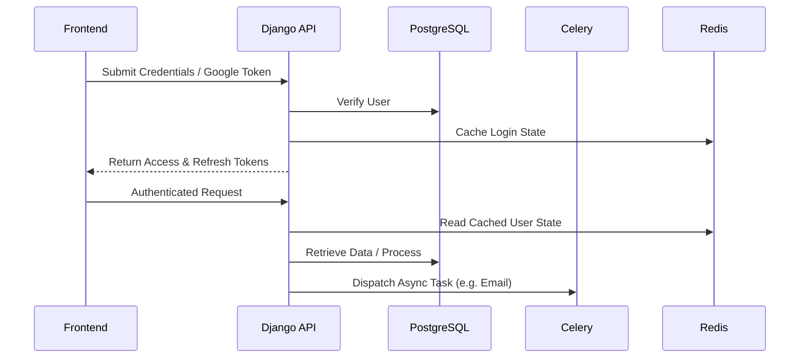
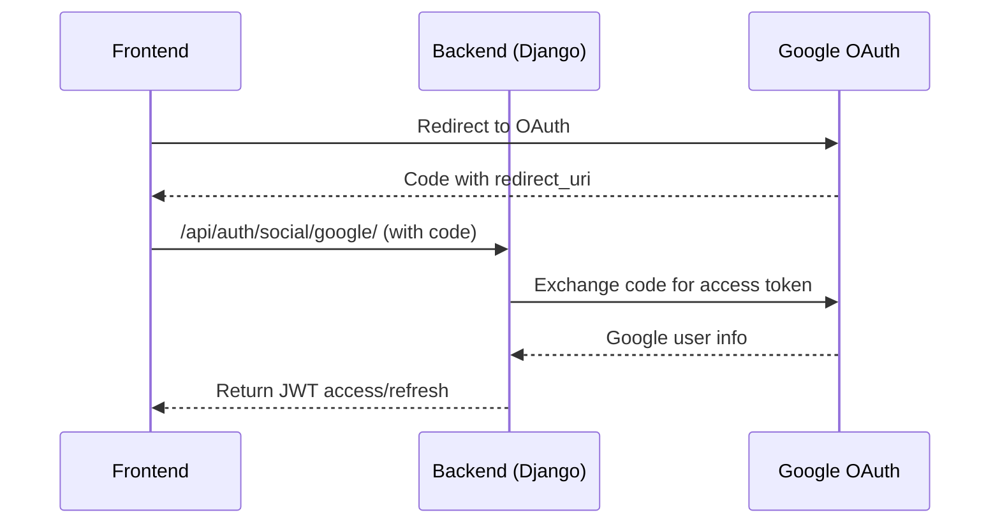
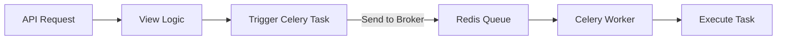

# fm-core

**FM-Core** is the transactional and orchestration backbone of the platform’s online ordering and commerce domain for the online ordering system of Finer FinMark project initiative of FinMark Corporation. Architected as a robust Django REST Framework (DRF) application, it exposes a comprehensive set of endpoints for user authentication, cart management, order processing, and payment workflows, with a design that emphasizes scalability, security, and extensibility.

### Role in the System

* **Domain Authority:**
  The API is the system of record for user, cart, order, and payment data. It owns the entire lifecycle of a commerce transaction—from user onboarding and authentication (including social login), through cart operations, to order creation, payment, and fulfillment triggers.
* **Integration Hub:**
  It acts as the primary integration point for all client-facing channels (web, mobile, partner APIs), as well as for backend services that require up-to-date commerce data or need to trigger business events (e.g., notifications, analytics).
* **External Service Orchestration:**
  The API fetches and caches real-time service/product data from an external catalog (via EXPRESS\_SERVICE\_URL), ensuring users always interact with current offerings while optimizing for performance and resilience using Redis-backed caching.

### Capabilities

* **Authentication & User Management:**

  * Supports JWT, token, and Google OAuth2 authentication.
  * Enforces email verification, secure password policies, and soft user deactivation.
  * Implements granular permission classes (e.g., IsOwnerOrAdmin) for secure resource access.
* **Cart & Order Management:**

  * Atomic cart-to-order conversion with transactional integrity.
  * Business-rule-enforced order status transitions (pending, confirmed, paid, completed, cancelled).
  * Strict ownership and staff override logic for sensitive operations.
* **Payment Processing:**

  * Multi-method payment support (Maya, Card, PayPal).
  * Payment triggers status changes and asynchronous order confirmation emails via Celery.
* **Caching & Performance:**

  * Aggressive Redis caching for cart, order, and service data.
  * Cache invalidation on all write operations to guarantee consistency.
* **Resilience & Observability:**

  * Graceful cache failure handling (IGNORE\_EXCEPTIONS).
  * Configurable for distributed deployment, with stateless application servers and centralized cache/task management.
* **Security:**

  * Strong password hashers (Argon2, PBKDF2, BCrypt).
  * Rate-limited authentication endpoints to mitigate brute-force attacks.
  * CORS and CSRF protection for safe cross-origin API consumption.

### Microservice Context

If deployed as a microservice in a distributed system:

* **Commerce/Order Service:**
  This app would be the dedicated microservice responsible for all commerce-related workflows. It would expose well-defined RESTful APIs consumed by other services (e.g., inventory, fulfillment, billing, customer support).
* **Independent Scaling & Deployment:**
  The service can be scaled and deployed independently, with its own database, cache, and async worker pool.
* **API-Driven Eventing:**
  It can emit events (e.g., order paid, order completed) to a message broker, enabling integration with downstream microservices (such as notifications, analytics, or shipping).
* **Loose Coupling:**
  All inter-service communication occurs over HTTP (or potentially via async events), ensuring the service remains loosely coupled and replaceable.

### Strategic Value

* **Single Source of Truth:**
  Centralizes all business logic and data for commerce operations, reducing duplication and risk of data inconsistency.
* **Developer Enablement:**
  Provides self-describing, interactive API documentation (Swagger/ReDoc) for rapid integration and onboarding.
* **Operational Excellence:**
  Designed for high availability, with robust error handling, transactional guarantees, and observability hooks for monitoring and alerting.

### Collaboration Context

* **Team-Focused Docs:**
  The documentation supports both individual and team onboarding through clear structure and real-world implementation patterns. It aligns backend responsibilities with frontend expectations (e.g., token storage patterns, role-based routes, and REST semantics).
* **Auth Consistency Across Clients:**
  Designed to accommodate frontend teams consuming the API with SPA token-based auth, including refresh logic, cookies, and social login workflows. Clear cookie usage contracts enable secure token rotation across multiple platforms.
* **Security Posture Disclosure:**
  The documentation transparently explains security configurations and deployment assumptions, facilitating smoother DevSecOps and audit integration.

---

# fm-core Documentation

**FM-Core** is the transactional and orchestration backbone of the Finer FinMark platform’s online ordering and commerce domain. Built with Django REST Framework (DRF), it exposes RESTful endpoints for user authentication, cart management, order processing, and payment orchestration. The project is designed for scalability, security, and extensibility.

---

## Table of Contents

1. [Overview](#overview)
2. [Architecture](#architecture)
   2.1 [System Architecture Diagram](#system-architecture-diagram)
   2.2 [Request Lifecycle](#request-lifecycle)
3. [Application Structure](#application-structure)
4. [Authentication and Authorization](#authentication-and-authorization)
   4.1 [Authentication Methods](#authentication-methods)
   4.2 [Permissions](#permissions)
   4.3 [Custom User Model](#custom-user-model)
   4.4 [Google OAuth Integration](#google-oauth-integration)
   4.5 [Token Management with JWT](#token-management-with-jwt)
   4.6 [Role and Permission Enforcement](#role-and-permission-enforcement)
5. [Data Models](#data-models)
6. [Core Business Logic](#core-business-logic)
7. [Asynchronous Processing](#asynchronous-processing)
8. [Payment Workflow Deep Dive](#payment-workflow-deep-dive)
9. [Configuration & Environment](#configuration--environment)
10. [Security Design](#security-design)
11. [CORS and CSRF Strategy](#cors-and-csrf-strategy)
12. [Email Services](#email-services)
13. [API Documentation](#api-documentation)
14. [Accessing the API](#accessing-the-api)
15. [Key Workflows](#key-workflows)
16. [Third-Party Services and Integrations](#third-party-services-and-integrations)
17. [Deployment & Operations](#deployment--operations)
18. [Operational Considerations](#operational-considerations)
19. [Appendix: Mermaid Diagrams](#appendix-mermaid-diagrams)

---

## Overview

FM-Core is the core API powering user and order data across the FinMark ecosystem. It handles commerce transactions, social authentication, payment status management, and integrations with async job queues and external providers.

The system is designed for high-availability deployment in containerized environments with external integrations for caching, email, task queues, and OAuth-based login flows.

---

## Architecture

### System Architecture Diagram

```mermaid
graph TD
    subgraph Client Layer
        A[Frontend SPA (React/Vue)]
    end
    subgraph Backend Services
        B[Django REST API]
        C[Celery Worker]
        D[Redis: Cache & Broker]
        E[PostgreSQL Database]
        F[Mailgun: Email Service]
        G[Google OAuth2 Provider]
    end

    A -->|REST Calls| B
    B -->|DB Ops| E
    B -->|Cache Read/Write| D
    B -->|Dispatch Task| C
    C -->|Track Jobs| D
    C -->|Send Email| F
    A -->|OAuth Redirect| G
```

### Request Lifecycle



---

## Application Structure

The Django project follows modular best practices:

* `users`: Custom user model, permissions, JWT & OAuth2 auth.
* `orders`: Cart, Order, Payment models & workflows.
* `core`: Project-level config including Celery and DRF settings.

---

## Authentication and Authorization

### Authentication Methods

* **JWT Authentication**: `rest_framework_simplejwt` + Djoser
* **Token Authentication**: `rest_framework.authtoken`
* **Social Auth**: Google OAuth2 via `dj-rest-auth` + `allauth`
* **Session Auth**: For Django admin

### Permissions

* `IsAuthenticated`: Required for cart/order/payment APIs
* `IsOwnerOrAdmin`: Used for user deactivation
* **Throttling**: Login views rate-limited with `AnonRateThrottle`

### Custom User Model

```python
class User(AbstractUser):
    email = models.EmailField(unique=True)
    is_active = models.BooleanField(default=True)
    # login via username/email
```

### Google OAuth Integration

* Uses OAuth2 + PKCE
* Configured with callback & redirect URIs
* Returns JWT upon successful social login

### Token Management with JWT

```python
SIMPLE_JWT = {
    'ACCESS_TOKEN_LIFETIME': timedelta(minutes=60),
    'REFRESH_TOKEN_LIFETIME': timedelta(days=1),
    'BLACKLIST_AFTER_ROTATION': True,
    ...
}
```

### Role and Permission Enforcement

* Superusers/staff bypass ownership checks
* Regular users can only access their own resources

---

## Data Models

### User

* Fields: `username`, `email`, `is_active`, `last_login`, etc.

### Cart & CartItem

* Cart is one-to-one with User
* CartItems include `service_id`, `price`, `added_at`

### Order & OrderItem

* Order is ForeignKey to User, has many items
* Tracks `status`, `total_price`, `ordered_at`

### Payment

* Linked one-to-one to an Order
* Tracks `method`, `amount`, `paid_at`, `reference_id`

---

## Core Business Logic

### Cart Management

* Validates via external EXPRESS\_SERVICE\_URL
* Prevents duplicates
* Caches per user for 5 min

### Order Processing

* Checkout converts Cart → Order atomically
* Enforces allowed transitions (pending → paid → completed)
* Staff override allowed transitions

### Permissions & Security

* Auth required everywhere except auth routes
* Only order owners or admins may update status

### Caching

* Redis used for all caching
* Carts, Orders, and Service Info are cached

---

## Asynchronous Processing

### Celery Integration

```python
CELERY_BROKER_URL = REDIS_URL
CELERY_TASK_SERIALIZER = 'json'
CELERY_TRACK_STARTED = True
```

### Redis as Broker and Cache

* Shared Redis instance with separate keys for queues and cache

### Order Confirmation Email

* Triggered from `OrderViewSet.pay()`
* Queued task with `@shared_task`

---

## Payment Workflow Deep Dive

Payments can be triggered via user POST requests or admin actions. The backend validates the payment, creates a Payment object, updates Order status, and dispatches a confirmation task.

### Order Status Transitions

| Current   | Action             | Next      |
| --------- | ------------------ | --------- |
| pending   | checkout/pay       | confirmed |
| confirmed | successful payment | paid      |
| paid      | manual/staff       | completed |

### Post-Payment Side Effects

* Email notification
* Cache invalidation
* Eventual webhook support

---

## Configuration & Environment

* Environment variables via `python-decouple`
* SQLite for tests, PostgreSQL for production
* Mailgun, Redis, Google, and Celery URLs configurable

---

## Security Design

* Argon2 password hashing
* JWT rotation + blacklist
* HTTPS-only cookies (in production)

---

## CORS and CSRF Strategy

* Configured using `django-cors-headers`
* Only allows whitelisted domains

---

## Email Services

* Handled by `anymail` using Mailgun
* Used for verification, reset, and order confirmation

---

## API Documentation

* `/api/schema/` — OpenAPI JSON
* `/api/docs/` — Swagger UI
* `/api/redoc/` — ReDoc view

---

## Accessing the API

* Auth: `/api/users/auth/login/`, `/registration/`
* Cart: `/api/cart/`
* Checkout: `/api/orders/checkout/`
* Payment: `/api/orders/<id>/pay/`
* Docs: `/api/docs/`

---

## Key Workflows

### User Registration

1. Register (Djoser or dj-rest-auth)
2. Verify email (if enabled)
3. Login and use access token

### Order Flow

1. Add to cart
2. Checkout → creates Order
3. Pay → updates status, triggers email

---

## Third-Party Services and Integrations

* Google OAuth (social login)
* Mailgun (transactional email)
* Redis (cache & Celery broker)
* Celery (task queue)
* Django Allauth, dj-rest-auth, djoser

---

## Deployment & Operations

* Uses Whitenoise for static files
* Secrets via ENV vars
* Secure headers + HSTS

---

## Operational Considerations

* CI/CD recommended with Docker + GitHub Actions
* Monitoring via Sentry or Prometheus
* Future: API versioning + microservice decomposition

---

## Appendix: Mermaid Diagrams

See `Architecture` and `Lifecycle` sections for system-wide diagrams.


## 11. Appendix: Additional Diagrams

### JWT Authentication Flow



### Celery Task Dispatch


